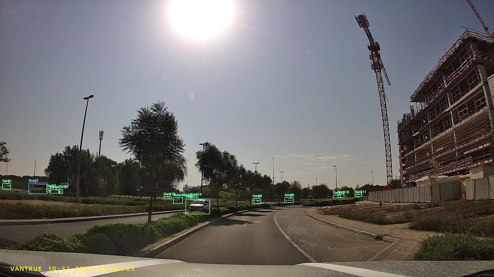
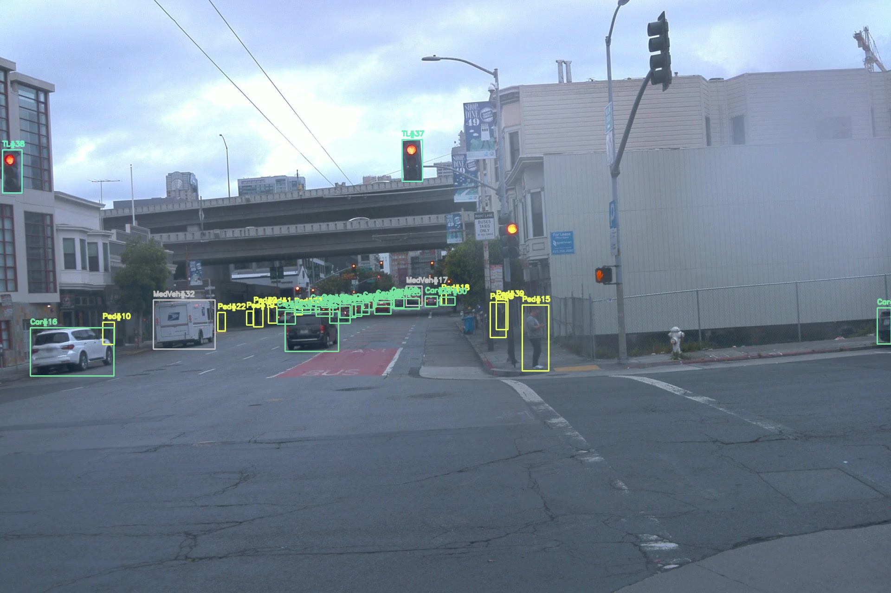

<div align="center"></div>

# YOLOX-ROAD

A fork of [YOLOX](https://github.com/Megvii-BaseDetection/YOLOX) for road-scene object detection on the **EMT** and **ROAD Waymo** datasets.

This fork preserves the full upstream YOLOX training and deployment stack and adds:

- **EMT dataset support** — 3-class road-scene taxonomy (VRU, Two-Wheeler, Vehicle)
- **ROAD Waymo dataset support** — converted to COCO JSON for standard YOLOX training
- **Rare-class oversampling** — image-level weighted sampler ([`WeightedInfiniteSampler`](yolox/data/samplers.py))
- **Per-class weighted loss** — configurable per-class BCE weights in the detection head ([`yolo_head.py`](yolox/models/yolo_head.py))
- **Dataset conversion utilities** — KITTI-style and ROAD Waymo → COCO JSON converters
- **Annotation visualization tools** — KITTI TXT and COCO JSON label rendering
- **Evaluation toolkit** — PR curves, AP@IoU, COCO mAP@0.5:0.95, best-F1 threshold selection

---

## Sample Detections

| EMT | ROAD Waymo |
|:---:|:---:|
|  |  |

Classes: **VulnerableRoadUser** (pedestrian/cyclist) · **Two-Wheeler** (motorbike/small motorised) · **Vehicle** (car/bus/van/emergency)

---

## Quick Start

Get from clone to running inference in five commands:

```shell
# 1. Clone and install
git clone https://github.com/Murdism/YOLOX_ROAD.git && cd YOLOX_ROAD
pip install -v -e .

# 2. Download a checkpoint (see Detector Checkpoints section)
mkdir -p checkpoints/final
# place yolox_emt_coco.pth in checkpoints/final/

# 3. Run inference on an image folder
python tools/demo.py image \
  -f exps/example/custom/yolo_emt.py \
  -c checkpoints/final/yolox_emt_coco.pth \
  --path assets/ --conf 0.3 --nms 0.5 --tsize 1280 --save_result

# 4. Run inference on a video
python tools/demo.py video \
  -f exps/example/custom/yolo_emt.py \
  -c checkpoints/final/yolox_emt_coco.pth \
  --path video.mp4 --conf 0.3 --nms 0.5 --tsize 1280 --save_result

# 5. Evaluate mAP on EMT test set (expects datasets/ layout described below)
python tools/eval.py \
  -f exps/example/custom/yolo_emt.py \
  -c checkpoints/final/yolox_emt_coco.pth \
  -b 8 -d 1 --conf 0.01 --nms 0.5 --tsize 1280
```

Demo outputs land in `YOLOX_outputs/<exp_name>/vis_res/`.

---

## Documentation

| Document | Description |
|---|---|
| [datasets/README.md](datasets/README.md) | Dataset directory layout, conversion commands, class taxonomy |
| [tools/support_scripts/README.md](tools/support_scripts/README.md) | All conversion, inspection, and dataset management scripts |

---

## Environment Setup

```shell
# Tested: Python 3.10, PyTorch 2.x, CUDA 12.x
conda create -n yolox_road python=3.10 -y
conda activate yolox_road

git clone https://github.com/Murdism/YOLOX_ROAD.git && cd YOLOX_ROAD
pip install -r requirements.txt
pip install -v -e .
```

Minimum requirements: Python ≥ 3.7, PyTorch ≥ 1.7, CUDA GPU recommended for training and inference (CPU works for small-scale testing).

---

## Detector Checkpoints

Checkpoints are too large to commit (~430 MB each). Download from Google Drive:

| File | Description | Link | mAP@0.5:0.95 |
|---|---|---|---|
| `yolox_emt_coco.pth` | Trained on EMT from COCO pretrained | [Drive](https://drive.google.com/file/d/14lHFGtxg0GQtkLjNLLzHMHAGwTTkGoIH/view?usp=sharing) | 0.287 (EMT test) |
| `yolox_emt_waymo.pth` | Fine-tuned on EMT from Waymo checkpoint | [Drive](https://drive.google.com/file/d/16_YmZiwy58sD1SKIY5b4F-hpqCCnhQCL/view?usp=sharing) | 0.287 (EMT test) |
| `yolox_road_waymo.pth` | Trained on ROAD Waymo from COCO pretrained | [Drive](https://drive.google.com/file/d/1EZs1VSeQECoOWuASN6Pbt3b0pX70MOkl/view?usp=drive_link) | 0.307 (Waymo val) |

Place files in `checkpoints/final/`.

### Per-class performance on EMT test set

**mAP** — AP@0.5:0.95, fp32, 1280×1280 input, evaluated with pycocotools.

| Detector | VRU | Two-Wheeler | Vehicle | mAP@0.5:0.95 | mAP@0.5 |
|---|---|---|---|---|---|
| COCO → Waymo (cross-domain) | 17.1 | 2.9 | 28.6 | 0.162 | — |
| Waymo → EMT | 21.5 | 21.6 | 43.1 | 0.287 | — |
| COCO → EMT | 21.4 | 22.0 | 42.7 | 0.287 | — |

**Best-F1 operating point** — threshold selected on train split, evaluated on test split, IoU@0.5.

| Detector | Class | Threshold | Precision↑ | Recall↑ | F1↑ |
|---|---|---|---|---|---|
| COCO → EMT | VulnerableRoadUser | 0.336 | 0.621 | 0.387 | 0.477 |
| COCO → EMT | Two-Wheeler | 0.310 | 0.805 | 0.367 | 0.504 |
| COCO → EMT | Vehicle | 0.369 | 0.829 | 0.624 | 0.712 |
| COCO → EMT | **Overall (micro)** | 0.359 | **0.816** | **0.607** | **0.696** |

---

## Dataset Setup

Data is looked up from `./datasets/` by default. Override by setting the environment variable:

```shell
export YOLOX_DATADIR=/path/to/your/datasets
```

If `YOLOX_DATADIR` is unset, all exp files resolve data relative to the project root (`YOLOX_ROAD/datasets/`).

> Full layout details and conversion commands are in [datasets/README.md](datasets/README.md).

### EMT

```
datasets/EMT/
├── frames/                              # all images (train and test share this)
└── annotations/
    └── detections_new/
        ├── train_3class.json
        └── test_3class.json
```

If your annotations are in KITTI-style `.txt` format, convert first:

```shell
python tools/support_scripts/emt_to_coco.py
```

### ROAD Waymo

```
datasets/road_waymo/
├── train_frames/                        # all frames
├── road_waymo_trainval_v1.0.json        # original source annotations
└── road_waymo_annotations/
    ├── train_3class.json                # generated below
    └── val_3class.json
```

Generate the 3-class annotation files:

```shell
python tools/support_scripts/road_waymo_tool.py merge --split train --preset emt \
    --out datasets/road_waymo/road_waymo_annotations/train_3class.json

python tools/support_scripts/road_waymo_tool.py merge --split val --preset emt \
    --out datasets/road_waymo/road_waymo_annotations/val_3class.json
```

---

## Training

### Pretrained COCO weights (required for training from scratch)

Download the YOLOX-L COCO pretrained weights and place in `pretrained/`:

```shell
mkdir -p pretrained
# Download yolox_l.pth from upstream YOLOX releases:
# https://github.com/Megvii-BaseDetection/YOLOX/releases/download/0.1.1rc0/yolox_l.pth
wget -P pretrained/ https://github.com/Megvii-BaseDetection/YOLOX/releases/download/0.1.1rc0/yolox_l.pth
```

### Training commands

**EMT — from COCO pretrained weights:**

```shell
python -m yolox.tools.train \
  -f exps/example/custom/yolo_emt.py \
  -d 1 -b 8 --fp16 -o \
  -c pretrained/yolox_l.pth
```

**EMT — fine-tune from ROAD-Waymo checkpoint (Waymo → EMT transfer):**

```shell
python -m yolox.tools.train \
  -f exps/example/custom/yolo_emt_from_waymo.py \
  -d 1 -b 8 --fp16 -o \
  -c checkpoints/final/yolox_road_waymo.pth
```

**ROAD Waymo — from COCO pretrained:**

```shell
python -m yolox.tools.train \
  -f exps/example/custom/yolo_road_waymo.py \
  -d 1 -b 8 --fp16 -o \
  -c pretrained/yolox_l.pth
```

**Multi-GPU example (4 GPUs):**

```shell
python -m yolox.tools.train \
  -f exps/example/custom/yolo_emt.py \
  -d 4 -b 32 --fp16 -o \
  -c pretrained/yolox_l.pth
```

Common flags: `-d` = number of GPUs · `-b` = total batch size · `--fp16` = mixed precision · `-o` = occupy GPU memory upfront · `--cache` = cache images in RAM.

### Outputs and monitoring

Checkpoints and logs are saved under `checkpoints/<exp_name>/`:

```
checkpoints/yolox_emt/
├── best_ckpt.pth        # best validation checkpoint
├── last_epoch_ckpt.pth  # latest checkpoint (use to resume)
└── train_log.txt        # full training log
```

Monitor training with TensorBoard:

```shell
tensorboard --logdir checkpoints/<exp_name>/tensorboard
```

**Resume a stopped run:**

```shell
python -m yolox.tools.train \
  -f exps/example/custom/yolo_emt.py \
  -d 1 -b 8 --fp16 -o \
  --resume                                        # resumes from last_epoch_ckpt.pth automatically
```

### Training configuration reference

| Parameter | COCO → EMT | Waymo → EMT | COCO → Waymo |
|---|---|---|---|
| Exp file | [`yolo_emt.py`](exps/example/custom/yolo_emt.py) | [`yolo_emt_from_waymo.py`](exps/example/custom/yolo_emt_from_waymo.py) | [`yolo_road_waymo.py`](exps/example/custom/yolo_road_waymo.py) |
| Input size | 1280×1280 | 1280×1280 | 1280×1280 |
| Max epochs | 120 | 30 | 60 |
| Warmup epochs | 5 | 1 | 3 |
| LR per image | 0.001/64 | 0.0001/64 | 0.001/64 |
| Class weights (VRU / TW / Veh) | 2.0 / 3.0 / 1.0 | 1.5 / 2.0 / 1.0 | 1.5 / 6.0 / 1.0 |
| Oversample factor cap | 4.0 | 3.0 | 8.0 |
| Oversample targets | VRU, Two-Wheeler | VRU, Two-Wheeler | Two-Wheeler only |
| Mosaic / Mixup prob | 0.8 / 0.5 | 0.5 / 0.3 | 0.8 / 0.5 |

---

## Inference on Custom Data

Use `tools/demo.py` from the upstream YOLOX stack — it works with all exp files in this repo.

```shell
# Single image
python tools/demo.py image \
  -f exps/example/custom/yolo_emt.py \
  -c checkpoints/final/yolox_emt_coco.pth \
  --path /path/to/image.jpg \
  --conf 0.3 --nms 0.5 --tsize 1280 --save_result

# Folder of images
python tools/demo.py image \
  -f exps/example/custom/yolo_emt.py \
  -c checkpoints/final/yolox_emt_coco.pth \
  --path /path/to/frames/ \
  --conf 0.3 --nms 0.5 --tsize 1280 --save_result

# Video file
python tools/demo.py video \
  -f exps/example/custom/yolo_emt.py \
  -c checkpoints/final/yolox_emt_coco.pth \
  --path /path/to/video.mp4 \
  --conf 0.3 --nms 0.5 --tsize 1280 --save_result

# Webcam (device 0)
python tools/demo.py video \
  -f exps/example/custom/yolo_emt.py \
  -c checkpoints/final/yolox_emt_coco.pth \
  --path 0 --conf 0.3 --nms 0.5 --tsize 1280
```

Results are saved to `YOLOX_outputs/<exp_name>/vis_res/`.

**Choosing `--conf`:** `0.3` is a good default for visualization. For tracking or deployment, use the per-class best-F1 thresholds from the table above (~0.31–0.37). Lower `--conf` increases recall at the cost of more false positives.

---

## Evaluation

### mAP (COCO API) — primary benchmark metric

Use this for the official mAP numbers. Runs GPU inference and pycocotools evaluation in one step.

```shell
# COCO → EMT  →  expect mAP@0.5:0.95 = 0.287
python tools/eval.py \
  -f exps/example/custom/yolo_emt.py \
  -c checkpoints/final/yolox_emt_coco.pth \
  -b 8 -d 1 --conf 0.01 --nms 0.5 --tsize 1280

# Waymo → EMT  →  expect mAP@0.5:0.95 = 0.287
python tools/eval.py \
  -f exps/example/custom/yolo_emt_from_waymo.py \
  -c checkpoints/final/yolox_emt_waymo.pth \
  -b 8 -d 1 --conf 0.01 --nms 0.5 --tsize 1280

# COCO → Waymo (cross-domain on EMT)  →  expect mAP@0.5:0.95 = 0.162
python tools/eval.py \
  -f exps/example/custom/yolo_emt_from_waymo.py \
  -c checkpoints/final/yolox_road_waymo.pth \
  -b 8 -d 1 --conf 0.01 --nms 0.5 --tsize 1280

# COCO → Waymo on Waymo val  →  expect mAP@0.5:0.95 = 0.307
python tools/eval.py \
  -f exps/example/custom/yolo_road_waymo.py \
  -c checkpoints/final/yolox_road_waymo.pth \
  -b 8 -d 1 --conf 0.01 --nms 0.5 --tsize 1280
```

### PR curves · AP · mAP · Best-F1 threshold — two-step workflow

Step 1 runs GPU inference once and saves predictions to JSON. Steps 2a–2b are CPU-only and fast — re-run them freely to change thresholds, IoU, or comparison groupings.

**Step 1 — dump predictions** (GPU, once per detector × split):

```shell
python tools/dump_predictions.py --detector emt       --split test
python tools/dump_predictions.py --detector waymo     --split test
python tools/dump_predictions.py --detector emt_waymo --split test
```

Outputs land in `results/` as `{detector}_{split}_preds.json`. Use `--split train` if you also need the training split.

Custom checkpoint / experiment file:

```shell
python tools/dump_predictions.py \
  -f exps/example/custom/yolo_emt.py \
  -c checkpoints/final/my_model.pth \
  --out results/my_model_test_preds.json
```

> **Important:** use `--conf 0.01` (the default) to match `eval.py`. Using `--conf 0.001` changes NMS behaviour and produces slightly different predictions, causing a ~0.02 mAP gap relative to pycocotools.

---

**Step 2a — Precision / Recall / F1 / FP / FN** at a fixed confidence threshold (`tools/eval_detectors.py`):

```shell
# Single detector, default IoU=0.5, conf=0.3
python tools/eval_detectors.py --split test --detectors emt

# Compare all three detectors; save report
python tools/eval_detectors.py --split test --detectors emt waymo emt_waymo \
  --iou 0.5 --conf 0.3 --save results/metrics.txt

# Full dataset (train + test — TP/FP/FN summed across both splits)
python tools/eval_detectors.py --split all --detectors emt waymo emt_waymo

# Custom GT and prediction files
python tools/eval_detectors.py \
  --gt   datasets/EMT/annotations/detections_new/test_3class.json \
  --pred results/my_model_test_preds.json \
  --name "My Model" --iou 0.5 --conf 0.3
```

> **`--split all`:** TP/FP/FN are accumulated across train and test before computing P/R/F1 — useful for tracking evaluation where the full dataset is used. Prediction files for both splits must already exist.

---

**Step 2b — PR curves, AP@IoU, COCO mAP@0.5:0.95, best-F1 threshold** (`tools/eval_pr.py`):

```shell
# Named detectors — produces figure + text report in results_latest/
python tools/eval_pr.py --split test --detectors emt waymo emt_waymo --nms 0.5

# Single detector
python tools/eval_pr.py --split test --detectors emt --nms 0.5

# Both splits combined
python tools/eval_pr.py --split all --detectors emt waymo emt_waymo --nms 0.5

# Custom GT and prediction files
python tools/eval_pr.py \
  --gt   datasets/EMT/annotations/detections_new/test_3class.json \
  --pred results/my_model_test_preds.json \
  --name "My Model" --nms 0.5
```

Key flags:

| Flag | Default | Description |
|---|---|---|
| `--iou` | 0.5 | IoU threshold for TP/FP matching |
| `--interp` | `coco` | AP interpolation: `coco` (exact pycocotools) \| `101` \| `all` (Pascal VOC) |
| `--max-dets` | 100 | Max detections per image (matches pycocotools `maxDets=100`). Set 0 to disable. |
| `--out-dir` | `results_latest` | Output directory |

Outputs (in `--out-dir`):

```
pr_curve_{split}_nms{nms}_iou{iou}_{interp}.png   # combined 2-row figure (per-class + micro)
pr_curve_{split}_nms{nms}_iou{iou}_{interp}.txt   # AP@IoU · AP@0.5:0.95 · mAP · best-F1 thresholds
```

The text report includes a **Best F1 Threshold** table — confidence thresholds that maximise F1 per class, derived by sweeping the full PR curve. Use the train-split thresholds for reporting on the test split (select on train, evaluate on test).

### What to report in a paper

| Metric | Tool | Notes |
|---|---|---|
| mAP@0.5:0.95, AP@0.5 per class | `eval.py` | Primary detection metric — use pycocotools numbers |
| PR curves | `eval_pr.py` | Full performance envelope, threshold-independent |
| P/R/F1 at operating point | `eval_detectors.py` | Secondary metric; select threshold on train split |

`DETECTOR_REGISTRY` and `GT_PATHS` at the top of each script control which checkpoints, experiment files, and annotation paths are used — edit them to add new detectors or splits.

---

## Fork-Specific Additions

### Rare-Class Oversampling

Imbalanced road datasets under-represent VRUs and two-wheelers. This fork adds [`WeightedInfiniteSampler`](yolox/data/samplers.py) which upsamples images containing rare classes at training time.

**How it works:**

```
repeat_factor(image) = max(
    max_image_frequency / class_frequency(c)
    for c in image if c is a target class
)
```

The sampler draws images via `torch.multinomial` with replacement, so rare-class images appear proportionally more often without duplicating data on disk. Distributed training is fully supported.

**Config knobs** (set in the exp file):

| Parameter | Default | Description |
|---|---|---|
| `enable_rare_class_oversampling` | `True` | Toggle the feature |
| `oversample_target_classes` | `("VulnerableRoadUser", "Two-Wheeler")` | Classes to oversample |
| `max_oversample_factor` | 4.0 (EMT) / 8.0 (Road) | Cap on per-image repeat factor |
| `auto_select_oversample_classes` | `False` | Auto-detect rare classes below threshold |
| `oversample_minority_ratio_threshold` | 0.2 | Frequency threshold for auto-selection |

Before training starts, the sampler logs per-class annotation counts and the projected distribution after weighting so you can verify the setup.

### Per-Class Weighted Loss

The detection head ([`yolox/models/yolo_head.py`](yolox/models/yolo_head.py)) accepts optional per-class weights applied to the binary cross-entropy classification loss:

```python
cls_loss_raw = BCEWithLogitsLoss()(cls_preds, cls_targets)   # [num_fg, num_classes]
if cls_loss_weights is not None:
    loss_cls = (cls_loss_raw * cls_loss_weights).sum() / num_fg
else:
    loss_cls = cls_loss_raw.sum() / num_fg
```

Default weights (order matches sorted category IDs):

| Class | ID | Weight (EMT) | Weight (Road-Waymo) |
|---|---|---|---|
| VulnerableRoadUser | 1 | 2.0 | 1.5 |
| Two-Wheeler | 2 | 3.0 | 6.0 |
| Vehicle | 3 | 1.0 | 1.0 |

Set `cls_loss_weights` in the exp file to adjust or disable.

---

## Annotation Visualization

> Full usage reference is in [tools/support_scripts/README.md](tools/support_scripts/README.md).

```shell
# Single KITTI-labeled frame
python tools/support_scripts/visualize_annotations.py \
  --label-format kitti \
  --labels-path datasets/EMT/emt_annotations/labels_full \
  --images-root datasets/EMT/frames \
  --mode sample --video-name video_054604 --frame-id 149

# Single COCO-labeled frame
python tools/support_scripts/visualize_annotations.py \
  --label-format coco \
  --labels-path datasets/EMT/annotations/detections_new/train_3class.json \
  --images-root datasets/EMT/frames \
  --mode sample --video-name video_054604 --frame-id 149

# Render and save a full video sequence
python tools/support_scripts/visualize_annotations.py \
  --label-format kitti \
  --labels-path datasets/EMT/emt_annotations/labels_full \
  --images-root datasets/EMT/frames \
  --mode video --video-name video_054604 --save-video
```

---

## Class Taxonomy

Both datasets use a unified 3-class scheme. See [datasets/README.md](datasets/README.md) for source-category mappings.

| ID | Class | Source Categories |
|---|---|---|
| 1 | VulnerableRoadUser | Pedestrian, Cyclist |
| 2 | Two-Wheeler | Motorbike, Small_motorised_vehicle |
| 3 | Vehicle | Car, Bus, Medium_vehicle, Large_vehicle, Emergency_vehicle |

Mapping scripts: [`emt_to_superclass.py`](tools/support_scripts/emt_to_superclass.py) · [`road_waymo_tool.py --preset emt`](tools/support_scripts/road_waymo_tool.py)

---

## Project Layout

```
YOLOX_ROAD/
├── exps/example/custom/               # experiment files (edit these to configure training)
│   ├── yolo_emt.py                    # COCO → EMT
│   ├── yolo_emt_from_waymo.py         # Waymo → EMT fine-tuning
│   └── yolo_road_waymo.py             # COCO → ROAD Waymo
├── yolox/
│   ├── data/
│   │   ├── datasets/
│   │   │   └── emt_dataset.py         # EMTDataset (shared by both EMT exp files)
│   │   └── samplers.py                # WeightedInfiniteSampler
│   ├── exp/
│   │   ├── yolox_emt.py               # EMT experiment base class
│   │   ├── yolox_emt_from_waymo.py    # fine-tuning variant
│   │   └── yolox_road.py              # ROAD Waymo experiment + RoadDataset
│   └── models/
│       └── yolo_head.py               # per-class weighted BCE loss
├── tools/
│   ├── demo.py                        # inference on images / video / webcam
│   ├── eval.py                        # mAP evaluation via pycocotools (primary metric)
│   ├── dump_predictions.py            # Step 1: GPU inference → COCO prediction JSON
│   ├── eval_detectors.py              # Step 2a: P / R / F1 / FP / FN at fixed threshold
│   ├── eval_pr.py                     # Step 2b: PR curves · AP · mAP · best-F1 threshold
│   └── support_scripts/               # see tools/support_scripts/README.md
│       ├── emt_to_coco.py             # KITTI → COCO conversion
│       ├── road_to_coco.py            # ROAD Waymo → COCO conversion
│       ├── road_waymo_tool.py         # stats, visualization, class remapping
│       └── visualize_annotations.py  # KITTI / COCO label renderer
├── pretrained/                        # place yolox_l.pth here (download from upstream)
├── checkpoints/final/                 # place downloaded .pth files here
├── datasets/                          # symlink or populate; see datasets/README.md
└── results_latest/                    # eval_pr.py outputs (figures + reports)
```

---

## Original YOLOX Reference

This fork is built on top of the official **[Megvii YOLOX](https://github.com/Megvii-BaseDetection/YOLOX)** repository. The upstream README covers standard COCO benchmarks, generic installation and demo usage, multi-GPU training, and ONNX / TensorRT / ncnn / OpenVINO export.

<details>
<summary>Upstream benchmark (COCO val)</summary>

| Model | Size | mAP val 0.5:0.95 | Params (M) | FLOPs (G) | Weights |
|---|---|---|---|---|---|
| YOLOX-s | 640 | 40.5 | 9.0 | 26.8 | [github](https://github.com/Megvii-BaseDetection/YOLOX/releases/download/0.1.1rc0/yolox_s.pth) |
| YOLOX-m | 640 | 46.9 | 25.3 | 73.8 | [github](https://github.com/Megvii-BaseDetection/YOLOX/releases/download/0.1.1rc0/yolox_m.pth) |
| YOLOX-l | 640 | 49.7 | 54.2 | 155.6 | [github](https://github.com/Megvii-BaseDetection/YOLOX/releases/download/0.1.1rc0/yolox_l.pth) |
| YOLOX-x | 640 | 51.1 | 99.1 | 281.9 | [github](https://github.com/Megvii-BaseDetection/YOLOX/releases/download/0.1.1rc0/yolox_x.pth) |

</details>

---

## Citation

If you use this work, please cite the EMT dataset paper:

```bibtex
@misc{madjid2025emtvisualmultitaskbenchmark,
  title         = {EMT: A Visual Multi-Task Benchmark Dataset for Autonomous Driving},
  author        = {Nadya Abdel Madjid and Murad Mebrahtu and Abdulrahman Ahmad and
                   Abdelmoamen Nasser and Bilal Hassan and Naoufel Werghi and
                   Jorge Dias and Majid Khonji},
  year          = {2025},
  eprint        = {2502.19260},
  archivePrefix = {arXiv},
  primaryClass  = {cs.CV},
  url           = {https://arxiv.org/abs/2502.19260},
}
```

If you use the underlying detector, please also cite the original YOLOX paper:

```bibtex
@article{yolox2021,
  title   = {YOLOX: Exceeding YOLO Series in 2021},
  author  = {Ge, Zheng and Liu, Songtao and Wang, Feng and Li, Zeming and Sun, Jian},
  journal = {arXiv preprint arXiv:2107.08430},
  year    = {2021}
}
```
